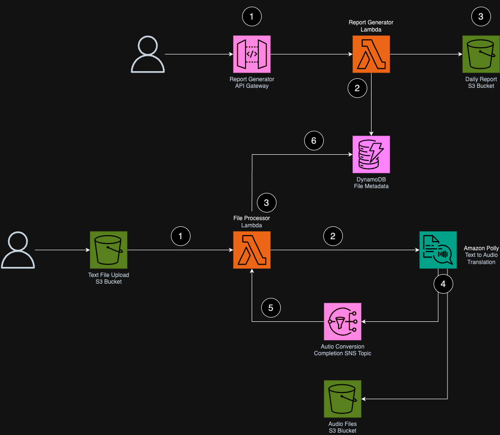

# Prototype Certification Debugging Challenge 

This application is designed to challenge your general cloud debugging skills, and is one part of the PACE Prototype Certification Assessment.

## Architecture

This serverless system had two functionalities. It converts a text file uploaded by a user into mp3 audio format, while recording metadata about the file and it's processing status. Additionally, it allows a user to generate a report from the data in the database. 



#### Text to Audio Pipeline
1. A user uploads a file to an S3 bucket containing text they want to convert into audio. This s3 bucket is configured to send object create events to the file processing lambda.
2. When the file processing lambda is invoked, it will make an asynchronous api call to Amazon Polly and receive Polly task details in the response.
3. The file processing lambda will then write file details and Amazon Polly file processing status to DynamoDB. 
4. When Amazon Polly is done creating the audio file, it will send an SNS notification. If the file was processed successfully, then Amazon Polly will also send the audio file to an S3 bucket.
5. The SNS notification will trigger the file processing lambda with a message containing file processing details. The lambda will use this to update the file processing status of the file in the DynamoDB table. 

#### Report Generation 
1. A user makes a request to API Gateway.
2. API Gateway is integrated with a report generation lambda, which will retrieve all processed files from DynamoDB based on the current date the request is made. 
3. After generating a CSV file from the data in DynamoDB, the report generation lambda will save the file to S3.

## Pre-reqs
This challenge solution requires the following software/tools:
* node.js / npm


## Deployment

1. Configure your AWS CLI with the AWS Account you will use to deploy this application.

2. Install the project dependencies
```bash
npm install
```

3. In the root directory of the repository there is a file called **make-env.TEMPLATE**. Copy this file and save it as **make-env**. This file contains environment variables that the project uses to follow naming conventions specific to this environment, and to understand the deployment region. 
```bash 
export APP_NAME:={REPLACE_ME}
export ENV_NAME:={REPLACE_ME}
export AWS_REGION:={REPLACE_ME}
```   
4. In the **/config** folder you will find an **ENV.configuration.yaml** file. Copy and save this file while replacing **ENV** in the file name with the **ENV_NAME** you set in your **make-env** file. Then, replace the email value in this file with your email. This file is where you may put values such as service specific configuration.

5. Make sure you're in the root directory of the project and deploy the project with the following make commands.
```bash
make deploy-cdk2-bootstrap-cf-stack
make deploy-infra
```
## Debugging Challenge

This system was intentionally built with 6 bugs for you to find that affect the correct functionality of both workflows. Your task is as follows:
1. Clone this repo and follow the deployment and correctness testing instructions.
2. Find and record each bug you find in the system.
2. Fix the bugs. **NOTE: It's okay to start with console fixes, but ultimately you must fix your system with code**.
3. When you are done, run the command below (unchanged) to generate a diff file documenting your code changes:
```bash
git diff origin/main -- > ${USER}_protochallenge.diff
```
4. Send this file to your Prototype Mentor to discuss the bugs and how you fixed them, as well as prove correctness of both workflows. 

## Testing Correctness
Here are some key success criteria that you should look for when validating your workflows:

#### Text to Audio Pipeline
1. When a file is uploaded to the file upload s3 bucket, you should see an equivalent audio file created in the audio output s3 bucket after a few minutes. 
2. You should see 2 events trigger the file processing lambda. One from S3 on file upload, and one from SNS that Amazon polly sends a message to indicating a finished file processing task. 
3. In DynamoDB a sucessfully processed message always ends with a task_status of **COMPLETED**.

#### Report Generation 
1. When you make a call to API gateway, you should see a success message as a reponse. 
2. When you make a call to API gateway, you should see the lambda get successfully invoked.
3. When the lambda is finished running, there should be a report generated in S3 with some rows populated.
# proto
